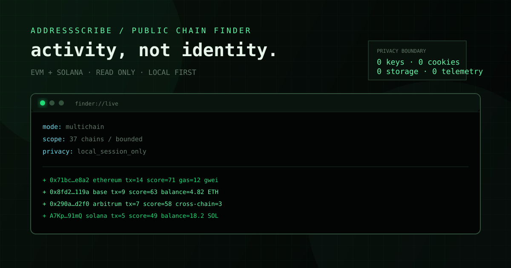

<p align="center">
  
</p>

<h1 align="center">AddressScribe</h1>

<p align="center">Read-only мультисетевой finder публичной активности EVM- и SVM-адресов.<br>Terminal UI · PWA · CLI · zero runtime dependencies.</p>

AddressScribe находит публичные адреса в ограниченном окне блоков или слотов, ранжирует их по прозрачной активности, показывает публичный native-баланс уже найденных адресов и объединяет один EVM-адрес между сетями. Это не keyfinder: кошельки не генерируются, приватные ключи не создаются и не запрашиваются, транзакции не подписываются.

## Что умеет

- **Транзакции** — собирает EVM-блоки и Solana slots, классифицирует EOA/contract/program, считает активность и строит explainable score.
- **Балансы** — сортирует только адреса, уже найденные в выбранном диапазоне, по публичному native-балансу.
- **Все сети** — объединяет активность одного EVM-адреса между mainnet/L2 сетями; разные валюты не складываются в выдуманный USD-баланс.
- **37 сетей** — 36 EVM-сетей из registry `0xNFT` и актуальных 0x additions, плюс Solana как первый SVM adapter.
- **0x metadata** — 22 EVM-сети из актуального списка 0x Swap/Gasless API и Solana помечаются как metadata-only. Этот проект не исполняет swaps.
- **Live browser panel** — NDJSON-поток показывает результаты по мере готовности каждой сети.
- **PWA** — один responsive-интерфейс для телефона, планшета и desktop; статическая оболочка доступна offline.
- **CLI** — те же режимы с JSON, JSONL, CSV или безопасным stdout.
- **Public RPC etiquette** — batch до 20 calls, per-endpoint rate limit, bounded concurrency, Retry-After и честный partial coverage.

> «Все сети» означает поддерживаемый registry и параллельную обработку, а не бесплатную глобальную историю всех блокчейнов. Полный historical scan требует hosted RPC/indexer и не входит в обещания pet project.

## Быстрый старт

Требуется Node.js `20.19+`.

```bash
git clone https://github.com/anontype/AddressScribe.git
cd AddressScribe
npm install
npm start
```

Откройте `http://127.0.0.1:4173`.

Для разработки:

```bash
npm run dev
```

## CLI

```bash
node src/cli.js chains
node src/cli.js scan --chain ethereum --blocks 5
node src/cli.js scan --chain base,arbitrum,solana --mode multichain
node src/cli.js scan --chain all --mode balances --blocks 2 --limit 100
node src/cli.js scan --chain ethereum --format jsonl --output out/activity.jsonl
node src/cli.js serve --host 127.0.0.1 --port 4173
```

Режимы:

| Режим | Что означает |
|---|---|
| `activity` | Ранг по публичной транзакционной активности |
| `balances` | Native-баланс уже найденных адресов, без глобального поиска «богатых кошельков» |
| `multichain` | Один EVM-профиль по выбранным сетям |

## RPC

В репозитории лежат только публичные RPC без встроенных ключей. Для стабильной работы задайте собственные endpoint через окружение:

```bash
export BASE_RPC_URL="https://your-hosted-base-rpc.example"
export SOLANA_RPC_URL="https://your-hosted-solana-rpc.example"
export ADDRESSSCRIBE_RPC_URLS='{"ethereum":["https://your-hosted-eth-rpc.example"]}'
```

Приложение намеренно не загружает `.env` автоматически и не пишет секреты в `.env`. Файл `.env.example` содержит только имена переменных и пустые placeholders. Bounded response cap по умолчанию — 16 MiB; его можно уменьшить или поднять до 32 MiB через `ADDRESSSCRIBE_RPC_MAX_RESPONSE_BYTES`.

Привязка к LAN через HTTPS reverse proxy:

```bash
export ADDRESSSCRIBE_TOKEN="$(openssl rand -hex 32)"
node src/cli.js serve --host 127.0.0.1 --port 4173
```

Для установки PWA на телефон или другую сеть приложение публикуйте через HTTPS reverse proxy. Прямой plain-HTTP bind на `0.0.0.0` по умолчанию отклоняется; для доверенной локальной сети его можно включить только явно через `ADDRESSSCRIBE_ALLOW_INSECURE_LAN=1` или `--allow-insecure-lan`. Токен хранится только в памяти вкладки и передаётся заголовком `X-AddressScribe-Token`.

## Privacy boundary

- Нет `privateKey`, `mnemonic`, `seed phrase` и key generation API.
- Нет signing, `sendRawTransaction` или allowance changes.
- Нет cookies, `localStorage`, `sessionStorage`, analytics и telemetry.
- API отдаёт allowlisted fields; raw RPC payloads не попадают в UI.
- URL credentials/query keys редактируются в ошибках и никогда не логируются.
- Service worker кэширует только статическую оболочку и никогда `/api/*`.
- Checkpoint-файл, если он используется, содержит только cursor/hash/coverage и записывается с mode `0600`.
- `npm run privacy:check` и CI запрещают signing/key-generation imports, browser persistence и внешние executable assets.

Подробности: [`docs/PRIVACY.md`](docs/PRIVACY.md).

## Архитектура

```text
Browser PWA / CLI
       │
       ├── POST /api/scan
       └── POST /api/scan/stream  ── NDJSON progress
       │
       ▼
scanChains orchestrator
       │
       ├── EVM adapter ── eth_getBlockByNumber / eth_getCode / eth_getBalance
       └── Solana adapter ─ getSlot / getBlock / getMultipleAccounts / getBalance
       │
       ├── JSON-RPC batch client
       ├── rate limiter + retry policy
       ├── deterministic activity ranker
       └── coverage + safe exporters
```

Подробности: [`docs/ARCHITECTURE.md`](docs/ARCHITECTURE.md).

## Сеть и совместимость

- Node.js: `>=20.19.0`
- Runtime dependencies: `0`
- Browser: современные Chromium, Firefox и Safari с PWA/service-worker support
- Transport: HTTP JSON-RPC 2.0, batch до 20 calls
- EVM: full blocks + `eth_getCode` classification
- Solana: `jsonParsed` slots + `getMultipleAccounts` classification

Полная таблица registry: [`docs/CHAINS.md`](docs/CHAINS.md).

## Проверки

```bash
npm test
npm run lint
npm run typecheck
npm run privacy:check
npm run check
```

Тесты полностью offline: fake RPC, без реальной сети и без расходования RPC quota.

## Ограничения

- Поиск ограниченRecent range; для исторического индекса нужен hosted indexer.
- EVM balance показывает native currency, не полный token portfolio.
- EVM activity не раскрывает internal transactions без trace-capable RPC.
- Solana signer не равен доказанному владельцу человека; это публичный `wallet_candidate`.
- Reorg safety зависит от выбранного RPC и подтверждённого диапазона.
- «Все сети» может вернуть partial coverage, если публичный endpoint ограничен или не поддерживает нужный метод.

## Дорожная карта

- [x] EVM + Solana bounded scanner
- [x] activity / balances / multichain modes
- [x] responsive PWA + NDJSON live stream
- [x] JSON / JSONL / CSV
- [x] offline tests, lint, typecheck, privacy gate
- [ ] optional hosted-indexer adapter
- [ ] read-only token/NFT activity enrichment
- [ ] EVM reorg lineage checkpoints
- [ ] read-only 0x quote preview без execution

## Contributing

Нужны небольшие изолированные изменения, offline tests и объяснение privacy implication. Никогда не добавляйте реальные RPC keys, `.env`, адреса владельца, seed phrases или signed payloads в commits.

## License

[MIT](LICENSE)
